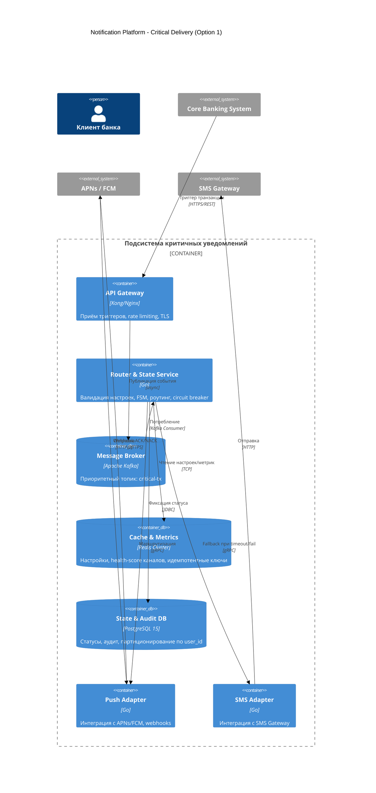
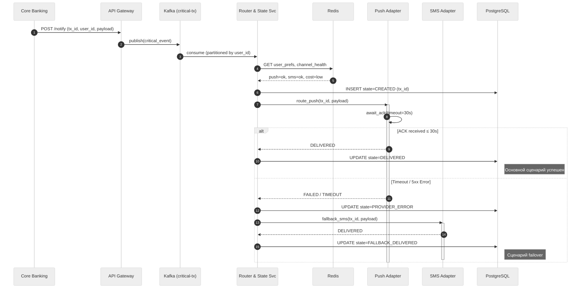
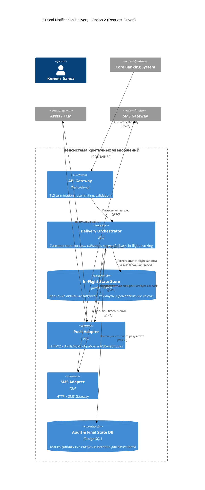
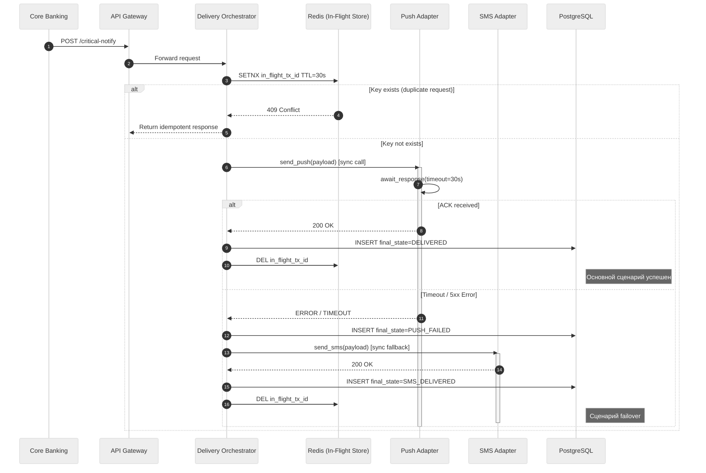

# RFC: Гарантированная доставка критичных уведомлений с кросс-канальным failover

| Метаданные | Значение |
|------------|----------|
| **Статус** | DRAFT |
| **Автор(ы)** | Алексей Димитриев |
| **Ответственный** | [Имя Фамилия] |
| **Бизнес-заказчик** | Head of Notifications / CPO |
| **Ревьюеры** | [Имя Фамилия, Дата] |
| **Дата создания** | 2026-04-08 |
| **Дата обновления** | 2026-04-08 |

---

## Оглавление

1. [Контекст](#контекст)
2. [Продуктовый анализ](#продуктовый-анализ)
3. [Пользовательские сценарии](#пользовательские-сценарии)
4. [Статистика](#статистика)
5. [Требования](#требования)
6. [Варианты решения](#варианты-решения)
7. [Сравнительный анализ](#сравнительный-анализ)
8. [Выводы](#выводы)
9. [Связанные задачи](#связанные-задачи)

---

## Контекст

В текущей архитектуре уведомления генерируются и отправляются децентрализованно: каждая команда самостоятельно взаимодействует с внешними провайдерами (SMS, Email, Push). Это приводит к задержкам, дублированию, отсутствию гарантии доставки критичных транзакционных событий и росту операционных затрат из-за неоптимального использования дорогих каналов.

Данный RFC фокусируется **исключительно на подсистеме гарантированной доставки критичных (транзакционных) уведомлений** с автоматическим кросс-канальным failover. Остальные типы уведомлений (сервисные, маркетинговые) вынесены за скобки данной инициативы.

### Ключевые вопросы

1. **Как реализовать failover с ожиданием статуса уведомления без нарушения SLA по задержке?** Требуется неблокирующий механизм ожидания ACK с таймаутом <=30с и асинхронным переключением.
2. **Как обеспечить последовательную доставку для одного пользователя при горизонтальном масштабировании?** Необходимо партиционирование очередей по `user_id` или `transaction_id` для сохранения порядка в рамках одной сессии.
3. **Как маршрутизировать уведомления на основе динамически меняющихся метрик каналов без создания единой точки отказа?** Требуется распределённый кэш health-score провайдеров и stateless-роутер, читающий метрики локально.

**Почему важно сейчас:** Рост транзакционной нагрузки, ужесточение регуляторных требований к фиксации доставки финансовых операций и рост жалоб пользователей на дубли/задержки требуют немедленной централизации и гарантий.
**Кто затронут:** Клиенты банка (гарантия получения), команды разработки (миграция на единый API), поддержка (снижение тикетов), SRE (новый мониторинг), Compliance (аудит доставки).

---

## Продуктовый анализ

Подсистема напрямую влияет на безопасность и доверие пользователей. Транзакционные уведомления (списания, переводы) не подлежат отключению пользователем по регуляторным требованиям. Цель: 100% доставка хотя бы через один канал при минимизации стоимости (приоритет Push -> fallback на SMS). Метрика `Channel Distribution` (>= 75% Push) контролирует экономику доставки.

---

## Пользовательские сценарии

| Приоритет | Тип сценария | Действующее лицо | Сценарий |
|-----------|--------------|------------------|----------|
| MUST HAVE | Основной | Система и пользователь | При активации триггера (перевод/оплата) система отправляет Push. При отсутствии ACK в течение 30 сек автоматически отправляет SMS. Дублирование исключено. |
| MUST HAVE | Fallback | Система | При сбое основного канала (ошибка провайдера/таймаут) роутер мгновенно выбирает резервный канал на основе метрик доступности и стоимости. |
| SHOULD HAVE | Настройка | Пользователь | Пользователь может выбрать предпочтительный канал для транзакций (Push или SMS). Маркетинговые/сервисные каналы отключаются отдельно. Транзакции отключить нельзя. |
| COULD HAVE | Мониторинг | Поддержка | Просмотр детальной истории доставки, статусов failover и причин ошибок для разбора инцидентов. |

**Приоритеты:**
- MUST HAVE — обязательно к реализации
- SHOULD HAVE — желательно реализовать
- COULD HAVE — опционально, при наличии ресурсов

---

## Требования

### Функциональные требования
> **Определение:** Функциональные требования определяют, каким должно быть поведение продукта в тех или иных условиях.

| № | Приоритет | Обозначение | Требование |
|---|-----------|-------------|------------|
| 1 | MUST HAVE | FR1 | Гарантия доставки: транзакционные уведомления отправляются через основной канал с автоматическим failover на резервный при отсутствии подтверждения. |
| 2 | MUST HAVE | FR2 | Защита от дублирования: система гарантирует ровно одну доставку на событие (идемпотентность по `notification_id`). |
| 3 | MUST HAVE | FR3 | Низкая задержка: 95% транзакционных уведомлений доставляются провайдеру ≤5 сек после активации триггера. |
| 4 | SHOULD HAVE | FR4 | Динамический роутинг: выбор канала учитывает пользовательские настройки, стоимость и актуальную загрузку провайдера. |

### Нефункциональные требования
> **Определение:** Нефункциональные требования определяют не что система делает, а как хорошо она это делает.

| № | Приоритет | Обозначение | Требование |
|---|-----------|-------------|------------|
| 1 | MUST HAVE | NFR1 | Fault Tolerance: детекция сбоя канала <=10 сек, переключение <=30 сек. |
| 2 | MUST HAVE | NFR2 | Масштабируемость: Обработка до 50.000 уведомлений в секунду без увеличения latency более чем на 25%. |
| 3 | MUST HAVE | NFR3 | Consistency: Последовательная отправка уведомлений для одного пользователя (strict ordering в рамках сессии). |
| 4 | SHOULD HAVE | NFR4 | Channel distribution: >=75% успешных доставок через Push при его технической доступности. |
| 5 | MUST HAVE | NFR5 | Наблюдаемость: Получение метрик (success rate, p95 latency, fallback ratio) с интервалом <=10 сек. |

**Расчёт нагрузок:**
- DAU: 3.000.000
- Транзакционные уведомления на пользователя/день: 2
- Суточный объём критичных уведомлений: `3.000.000 * 2 = 6.000.000`
- Средняя нагрузка: `6.000.000 / 86.400 сек ≈ 69 not/sec`
- Пиковая нагрузка: с учётом `Peak Concurrent Users: 300 000` и теоретической средней частоте уведомлений максимум в `0.1 not/(sec * user)` пиковая нагрузка `300.000 * 0.1 = 30.000 not/sec`.

### ASR (Архитектурно значимые требования)
| № | Приоритет | ASR | Связанные требования | Влияние на архитектуру |
|---|-----------|-----|----------------------|------------------------|
| 1 | MUST HAVE | Гарантированная доставка критичных уведомлений с автоматическим failover | FR1, FR3, NFR1, NFR3 | Требует явной машины состояний, персистентного хранения статуса, механизма таймаутов, идемпотентности и механизма восстановления для повторной обработки. |
| 2 | SHOULD HAVE | Изоляция критичного трафика от фоновой нагрузки | FR3, NFR2, NFR3 | Требует физического разделения очередей/консьюмеров, приоритизации и независимого горизонтального масштабирования. |
| 3 | MUST HAVE | Динамический роутинг с минимизацией стоимости | FR4, NFR4, NFR5 | Требует распределённого кэша метрик провайдеров, роутера с O(1) доступом к правилам маршрутизации и асинхронного сбора метрик. |

---

## Варианты решения

### Вариант 1: Событийная машина состояний + Kafka

> **Описание:** Архитектура на основе явной машины состояний. Каждое критичное уведомление проходит через состояния (`created - routed - sent - delivered/failed - fallback_sent`). Состояния хранятся в PostgreSQL, маршрутизация и буферизация реализованы через Apache Kafka, метрики и кэш настроек — через Redis.

#### Архитектура
**Технологии:** Go, Apache Kafka, PostgreSQL, Redis, APNs/FCM (провайдеры уведомлений), SMS-провайдер, gRPC, Prometheus/Grafana.

#### Выполнение ASR
- **ASR1 (Гарантированная доставка и failover):** Явная FSM в PostgreSQL фиксирует каждое состояние (CREATED → SENT → DELIVERED/FAILED → FALLBACK_SENT). Таймер 30с в адаптере инициирует автоматический вызов резервного канала. Идемпотентность обеспечивается уникальным tx_id в Redis, что исключает дубли при повторных попытках. Нерешаемые ошибки попадают в Kafka DLQ для ручного разбора.
- **ASR2 (Изоляция критичного трафика):** Критичные события пишутся в отдельный топик critical-tx с партиционированием по user_id. Потребители (Router Svc) запускаются в выделенном consumer group с приоритетным квотированием CPU/RAM в K8s. Маркетинговые рассылки используют независимые топики и пулы воркеров, исключая head-of-line blocking.
- **ASR3 (Динамический роутинг):** Stateless-компонент маршрутизации запрашивает метрики (latency, success_rate, стоимость) из Redis за O(1). Данные обновляются асинхронно через webhook-listeners провайдеров. Решение о канале принимается перед отправкой: приоритет всегда отдаётся Push, SMS используется только при деградации health-score или явном выборе пользователя.

#### Этапы реализации

| Этап | Описание | Планируемый срок | Ресурсы | Риски |
|------|----------|------------------|---------|-------|
| 1 | Развёртывание Kafka, PostgreSQL, Redis. Настройка топика critical-tx и партиционирования. | 2 недели | DevOPs, DBA | Сложности настройки и согласования |
| 2 | Реализация Router service, интеграция с Redis и Postgres. | 3 недели | 4 Backend, QA | Проблемы с многопоточностью |
| 3 | Разработка адаптеров Push/SMS, webhook-listeners. Нагрузка и failover-тесты. | 3 недели | 2 Backend, тестировщик | Кэш-инвалидация, неверный (неэффективный) роутинг |
| 4 | Канареечный релиз, документация, обработка фидбека пользователей. | 1 неделя | Поддержка, tech-writer | Невыполнение SLA в проде |

#### Преимущества
- Полный контроль над состояниями
- Предсказуемая latency
- Низкий overhead

#### Недостатки
- Сложная реализация
- Необходимость реализации сложной retry и failover логики
- Усложнение роутинга при появлении новых каналов

---

### Вариант 2: Request-Driven Orchestration с ожиданием отклика (Wait-for-Response)

> **Описание:** Архитектура на основе явного ожидания подтверждения от провайдера в рамках одного потока обработки. Система отправляет уведомление, регистрирует запрос в in-memory/Redis хранилище с TTL=30s и блокирует дальнейшие действия до получения отклика или таймаута. При успешном ответе процесс завершается. При сбое или отсутствии отклика в течение SLA автоматически инициируется fallback на резервный канал. Состояние не персистируется на каждом этапе, фиксируется только финальный результат для аудита.

#### Архитектура
**Технологии:** Go, gRPC, Redis, PostgreSQL (финальный аудит), APNs/FCM, SMS provider, Prometheus/Grafana.

#### Выполнение ASR
- **ASR1 (Гарантированная доставка и failover):** Оркестратор регистрирует запрос в Redis с TTL=30s перед вызовом адаптера. Поток выполнения синхронно ожидает ответа. При успешном ACK записывается финальный статус в PostgreSQL. При таймауте или ошибке управление возвращается Оркестратору, который немедленно вызывает SMS-адаптер. Защита от дублей обеспечивается атомарной SETNX в Redis. Может не выполняться при блокировке workers.
- **ASR2 (Изоляция критичного трафика):** Реализуется на уровне инфраструктуры: Orchestrator для критичных уведомлений деплоится в отдельные поды с увеличенным лимитом горутин/потоков и приоритетом в K8s scheduler. API Gateway разделяет входящие потоки по эндпоинтам (/critical-notify vs /marketing-notify) и применяет независимые rate-limit квоты.
- **ASR3 (Динамический роутинг):** Перед вызовом адаптера Оркестратор выполняет быстрый запрос к Redis за актуальными метриками каналов. Если health-score Push ниже порога или стоимость превышает лимит, система сразу маршрутизирует событие на SMS, минуя попытку отправки в Push. Логика выбора канала встроена в код Оркестратора, обновление метрик происходит фоновыми jobs.

#### Этапы реализации

| Этап | Описание | Планируемый срок | Ресурсы | Риски |
|------|----------|------------------|---------|-------|
| 1 | Развёртывание Kafka, PostgreSQL, Redis. Настройка топика critical-tx и партиционирования. | 2 недели | DevOPs, DBA | Сложности настройки и согласования |
| 2 | Реализация Delivery Orchestrator с синхронным ожиданием ACK, таймерами и логикой fallback. | 2 недели | 2 Backend, QA | Потеря состояния после сбоя |
| 3 | Разработка адаптеров Push/SMS, webhook-listeners. Нагрузка и failover-тесты. | 3 недели | Backend, тестировщик | Кэш-инвалидация, неверный (неэффективный) роутинг |
| 4 | Канареечный релиз, документация, обработка фидбека пользователей. | 1 неделя | Поддержка, tech-writer | Невыполнение SLA в проде |

#### Преимущества
- Минимальная задержка из-за отсутствия промежуточных состояний и обращений в БД
- Простота логики и реализации
- Меньшие затраты без машины состояний

#### Недостатки
- Уязвимости к сбоям и рестартам
- Сложности с последовательностью уведомлений при партиционировании
- Блокировка worker при ожидании отклика

---

## Сравнительный анализ

### Ресурсные требования

| Критерий | Вариант 1 | Вариант 2 |
|----------|-----------|-----------|
| Время реализации | 9 недель | 8 недель |
| Команда | DevOPs, DBA, 4 Backend, QA, Тестировщик, Поддержка, tech-writer | DevOPs, DBA, 2 Backend, QA, Тестировщик, Поддержка, tech-writer |
| Инфраструктура | Kafka (3 ноды), PostgreSQL, Redis Cluster. Умеренные ресурсы, горизонтально масштабируется линейно. | Redis Cluster, PostgreSQL, gRPC mesh. Ниже потребление на старте, но выше риск деградации при пиках из-за блокировки workers. |
| Организационные риски | Низкие из-за прозрачности системы | Умеренные из-за блокировок workers |

### Соответствие требованиям

| Требование | Вариант 1 | Вариант 2 |
|------------|-----------|-----------|
| FR1 | ✅ Да | ✅ Да |
| FR2 | ✅ Да | ✅ Да |
| FR3 | ✅ Да | ❌ Нет |
| FR4 | ✅ Да | ✅ Да |
| NFR1 | ✅ Да | ✅ Да |
| NFR2 | ✅ Да | ❌ Нет |
| NFR3 | ✅ Да | ✅ Да |
| NFR4 | ✅ Да | ✅ Да |
| NFR5 | ✅ Да | ✅ Да |
| ASR1 | ✅ Да | ❌ Нет |
| ASR2 | ✅ Да | ✅ Да |
| ASR3 | ✅ Да | ✅ Да |

---

## Выводы

> **Рекомендация:** 1 вариант

**Обоснование выбора:**
Несмотря на большие ресурсы для разработки, 1 вариант покрывает все требования, в отличие от 2 варианта, который не покрывает часть MUST HAVE требований. Таким образом, это выбор между "сделать сложнее, но надежнее" и "сделать проще, но хрупче", и лучше, очевидно, выбрать 1 вариант.

**Компромиссы**
- Разработка системы дольше и затратнее по ресурсам, но окупается за счет прозрачности системы и большего контроля
- Реальное и формальное получение уведомления может отличаться из-за особенностей ОС. Для минимизации риска введен жесткий fallback на SMS и мониторинга задержки показа
- Hot-партиционирование балансируется динамическим партиционированием

---

## Приложения

### Глоссарий
| Термин | Определение |
|--------|-------------|
| FSM (Finite State Machine) | Автомат, управляющий переходами статуса уведомления. |
| DLQ (Dead Letter Queue) | Специальная очередь для событий, которые не удалось доставить после заданного числа попыток. |
| Idempotency Key | Уникальный идентификатор, исключающий повторную обработку одного и того же события. |
| Circuit Breaker | Паттерн, временно блокирующий вызовы к деградировавшему провайдеру для предотвращения каскадных отказов. |
| In-Flight Tracking | Механизм отслеживания активных, но ещё не завершённых запросов на отправку. |
| ACK (Acknowledgement) | Подтверждение от внешнего провайдера (APNs, FCM, SMS Gateway и др.) о фактическом принятии уведомления. |
